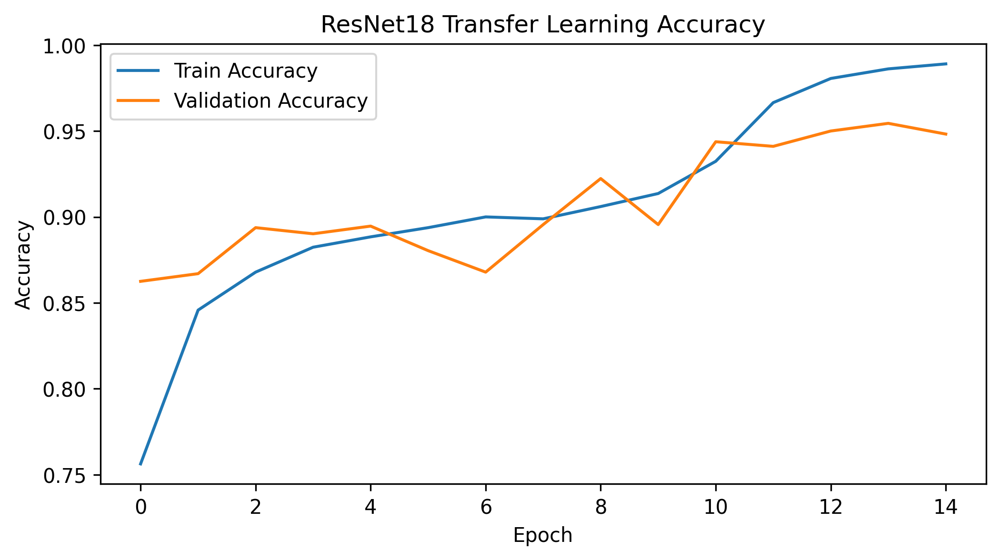
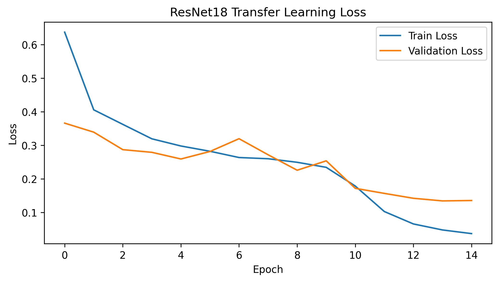
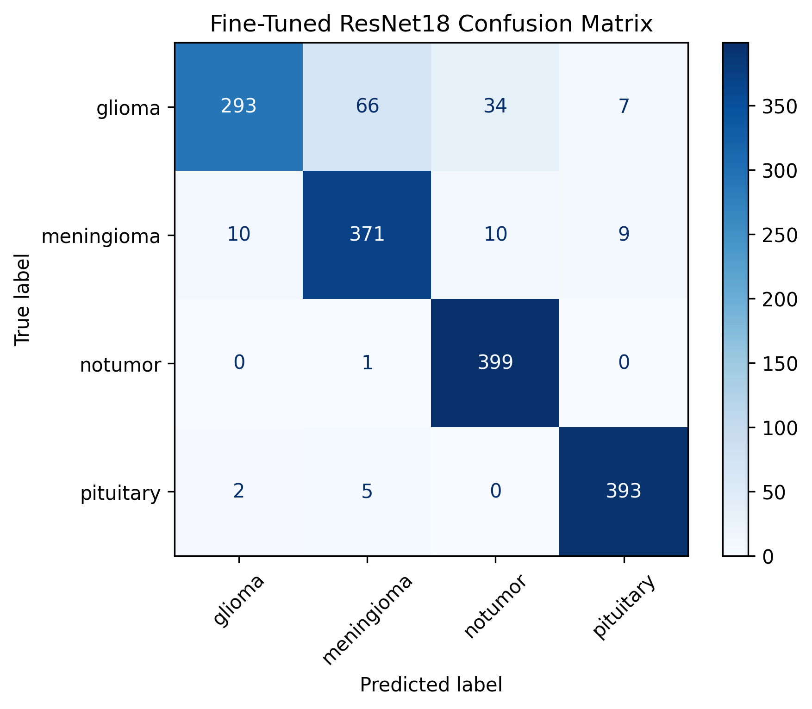
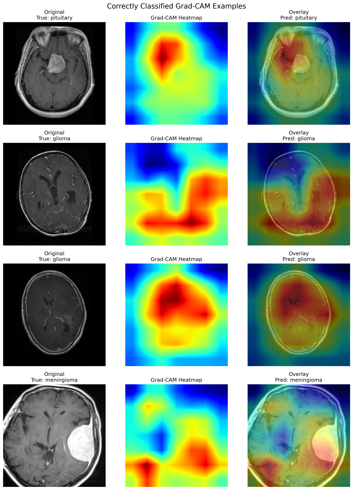
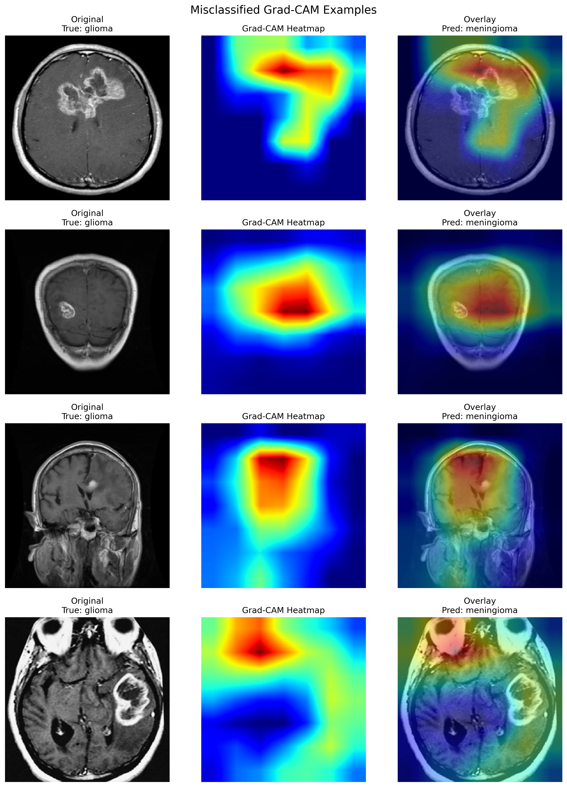

# Brain Tumor MRI Classification with CNNs and Transfer Learning

## Overview

This project builds a deep learning pipeline for classifying brain MRI images into four categories:

- Glioma
- Meningioma
- Pituitary tumor
- No tumor

The project begins with exploratory data analysis and a baseline convolutional neural network (CNN), then progresses toward transfer learning and model interpretability techniques such as Grad-CAM.

The goal is not only to achieve strong classification performance, but also to build a reproducible and interpretable neuro-imaging workflow.

Fine-tuned ResNet18 achieved **91.0% test accuracy** on the four-class MRI classification task.

---

## Dataset

Dataset source:

- Brain Tumor MRI Dataset (Kaggle)
- Source: https://www.kaggle.com/datasets/masoudnickparvar/brain-tumor-mri-dataset

The dataset contains labeled MRI scans split into training and testing sets.

---

## Project Structure

```text
brain-tumor-mri-classification/
├── data/              # Local dataset storage (not tracked by Git)
├── notebooks/         # Exploratory analysis, training, evaluation, and experiments
├── src/               # Reusable Python modules for config, datasets, and models
├── figures/           # Saved plots and visualizations used in the README
├── models/            # Saved model checkpoints (not tracked by Git)
├── reports/           # Future written summaries or project reports
├── README.md          # Project documentation
├── requirements.txt   # Python dependencies
└── .gitignore         # Files and folders excluded from Git tracking
```

---

## Workflow

### 1. Exploratory Data Analysis
- Class distribution
- MRI visualization
- Image dimension analysis

### 2. Dataset Pipeline
- PyTorch Dataset class
- Image preprocessing
- DataLoader setup

### 3. Baseline CNN
- Convolutional neural network trained from scratch
- Training and validation curves
- Baseline performance evaluation

### 4. Transfer Learning
- Comparison against pretrained architectures
- Fine-tuning experiments

### 5. Model Evaluation & Interpretability
- Confusion matrix
- Per-class accuracy
- Grad-CAM visualizations
- Error analysis

---

## Tech Stack

- Python 3.11
- PyTorch
- torchvision
- NumPy
- matplotlib
- scikit-learn
- Jupyter

---

## Setup

```bash
python3.11 -m venv .venv
source .venv/bin/activate
pip install -r requirements.txt
```

---

## Status

- Project setup complete
- Exploratory data analysis complete
- Dataset pipeline complete
- Baseline CNN training and evaluation complete
- Transfer learning experiments complete

The best-performing model was a fine-tuned ResNet18, which achieved **95.5% validation accuracy** and **91.0% test accuracy**.

The baseline CNN achieved **86.6% test accuracy**, while the frozen ResNet18 achieved **86.1% test accuracy**. Fine-tuning deeper ResNet18 layers produced the strongest generalization performance.

---

## Model Comparison

| Model | Best Validation Accuracy | Test Accuracy |
|---|---:|---:|
| Baseline CNN | 92.9% | 86.6% |
| Frozen ResNet18 | 92.2% | 86.1% |
| Fine-Tuned ResNet18 | 95.5% | 91.0% |

---

## Visual Results

### Fine-Tuned ResNet18 Accuracy Curve



### Fine-Tuned ResNet18 Loss Curve



### Fine-Tuned ResNet18 Confusion Matrix



### Grad-CAM Interpretability Examples

Correctly classified examples:



Misclassified examples:



---

## Key Findings

- A custom CNN trained from scratch achieved strong baseline performance on the MRI classification task.
- Frozen transfer learning with ResNet18 produced comparable validation performance, but did not outperform the baseline CNN on the held-out test set.
- Fine-tuning the deeper ResNet18 layers significantly improved performance, increasing test accuracy to approximately **91%**.
- Glioma classification remained the most challenging class across all experiments, while pituitary tumors and healthy scans achieved the strongest performance.
- Results suggest that partial fine-tuning of pretrained models is more effective for this MRI dataset than using fully frozen ImageNet features.
- Grad-CAM visualizations showed that the fine-tuned model often focused near tumor regions, but misclassified glioma cases sometimes showed broader or less localized attention patterns.

---

## Future Work

Potential future improvements include:
- Grad-CAM interpretability visualizations
- Data augmentation experiments
- EfficientNet and DenseNet comparisons
- Hyperparameter optimization
- Streamlit deployment for interactive inference